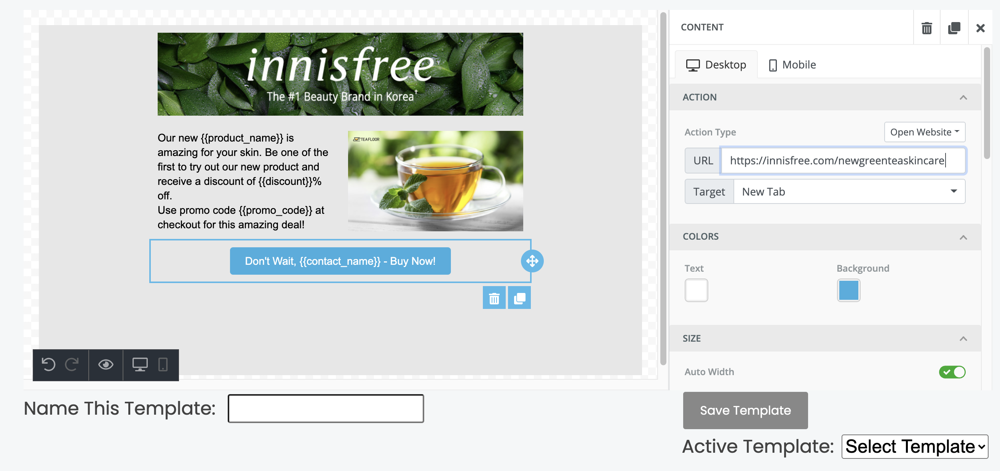

# Mail Monster

## Overview
MailMonster is an application for building reusable marketing email templates in an easy-to-use editor that supports detailed designs and templating for use with all of your company's customers.

## Project Demo
Before diving into the organization and infrasture of this project, this brief demo will take you through the high-level features:
[](https://youtu.be/D33SgNY79Bo)

## Getting Started

This application requires installation of [node.js](https://nodejs.org/en/download/) and [postgreSQL](https://www.postgresql.org/download/) to begin the setup process.

`git clone` this repo to your local machine. Once you `cd` in, run `npm install` to install the required dependencies.

You should be able to build the client-side code by running `npm run build-client`.

Before we can get our server up and running we need to be mindful of a few environmental dependencies.

### Environmental Dependencies

This application looks for multiple environmental variables when booting this application. 

1. `process.env.DATABASE_URL` - found within the `db` tier of the application and loaded in the `_db.js` file within - this must be set when running the application in production or you can use the fallback process when testing on local by creating a postgreSQL database named 'mailmonster' as well as one for testing called 'mailmonster-test'.

2. `process.env.SENDGRID_API_KEY` - This application takes advantage of the sendgrid api to handle email sending. Sendgrid require that you verify emails and/or domains before using them as valid "senders" on emails sent using our application. Pass in your key from the environment - with your personal API Keys to enable sending emails. Alternatively you can use the config file by placing a config file called `sendgrid.js` within the `config` directory in the following format: 
```js
module.exports = {
  apiKey: 'MY_SENDGRID_APIKEY'
};
```
Once you have accounted for these dependencies you can start up the application by running `npm start`!

## Code Style and Organization
* This project uses `prettier` throughout to maintain consistency in code. 
* The repo is currently broken into 3 major sections for each of the 3-tiers of the application (`client`, `server`, `db`). Each of these tiers are designed in a way that maps well to the infrastructure choice and challenges described below.
* There are additional top-level directories for static assets (`public`) and configuration (`config`).

## Infrastructure
MailMonster is currently a 3-tiered application.

### Tier 1 - Client Side
This section of the project, which is built using `react`, `react-router`, `redux`, `sass`, and other helper technologies, can be found within the browser code in the directory called `client`. Webpack begins it's bundling from the `index.js` file found within that directory and is responsible for bringing in the core pillars of the application found within the `components`, `store`, and `styles` subdirectories.

It's also worth noting that the main template component coms from [Unlayer](https://github.com/unlayer/react-email-editor) which in combination with the template-related components are responsible for the flexiblity of the core front-end.

### Tier 2 - Server Side
The server side prmarily utilizes `node.js` and `express` to allows for a dynamic, personalized experience for each site-user. 

#### Middleware
This application relies on an efficient middleware chain to support proper logging, authentication/authorization, extensibility, and error handling.

1. `morgan` Logging Middleware is used to track incoming requests, request/response time and more.
2. `bodyParser` - is used to process the body of an incoming request and attach it to the request for downstream to evaluate as necessary.
2. `passport` is used as a means of managing authentication along-side of `express-session` to manage cookies and sessions.
3. Custom error handling has been written for use here.

#### API Endpoints
The two subdirectories of the `server` folder - `api` and `auth` are responsible for the server logic. Some of the sanitization and filtering is also done downstream within the ORM to prevent poor data management closer to the source.

### Tier 3 - Database
This application currently solely relies on a postgreSQL database for long-term data storage. This database is managed within `node` via the `Sequelize` ORM. Two major data models are being used in the application's current state - Users and Templates.

## Features
1. Users can create accounts to manage and reuse their templates for email marketing.
2. Users can specify "variables" in their templates which can later be used with personal contacts.
3. Users can use templates and replace these variables with personal information.
4. Users can specify recipient of an email as well as the send of an email with an API key that has that user as an authorized sender through the sendgrid api.
5. Users can see their beautiful templates rendered with user data from the `campaigns` panel.
6. Users see notifications about their success / failures via a toast in the template creation and email sending processs.

## Features Coming in Next Update
1. Users will soon have the ability to Upload CSVs / Integrate with Google Sheets for Scalable Email Sending. Column headers will be processed and matched with the variables named in the templates.
2. Contacts, once used, will have the option of being saved to the account for easy reuse on new templates.